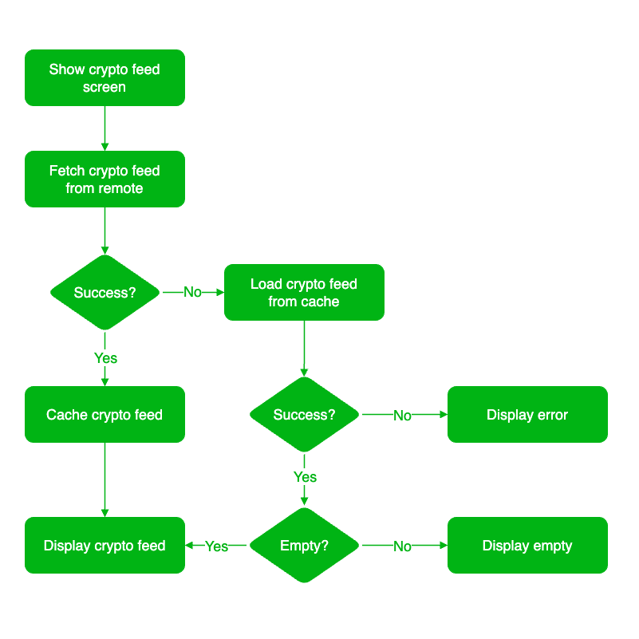
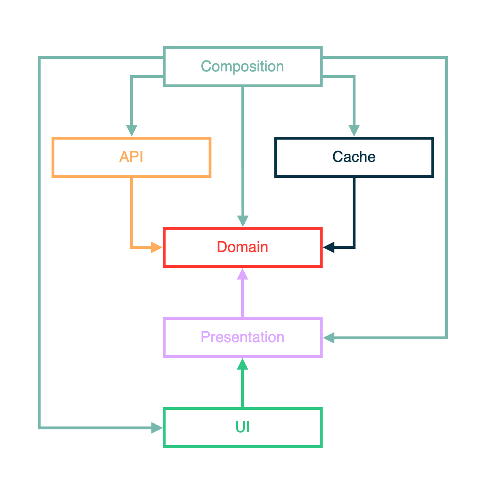

# Crypto App Case Study

## Story: User requests to see crypto feed top list in 24 hours

## Flowchart



## Crypto Feed Architecture



## BDD Specs

## Crypto Feed Feature

### Narrative #1

```
As a online user
I want the app to automatically load the crypto feed
So I can see the newest crypto feed
```

#### Scenarios (Acceptance criteria)

```
Given the user has connectivity
When the user requests to see the crypto feed
Then the app should display the latest crypto feed from remote
And replace the cache with the new crypto feed
```

### Narrative #2

```
As an offline user
I want the app to show the latest saved version of crypto feed
So I can always enjoy crypto feed
```

#### Scenarios (Acceptance criteria)

```
Given the user doesn't have connectivity
And there’s a cached version of the feed
When the user requests to see the feed
Then the app should display the latest feed saved
```

## Use Cases

### Load Crypto Feed From Remote Use Case

#### Primary Course (Happy Path):
1. Execute "Load Crypto Feed" command.
2. System validates downloaded data.
3. System creates crypto feed from valid data.
4. System delivers crypto feed.

#### No Connectivity – Error Course (Sad Path):
1. System delivers connectivity error.

#### Invalid Data – Error Course (Sad Path):
1. System delivers invalid data error.

#### Bad Request – Error Course (Sad Path):
1. System delivers bad request error.

#### Not Found – Error Course (Sad Path):
1. System delivers not found error.

#### Internal Server error – Error Course (Sad Path):
1. System delivers internal server error.

#### Unexpected error – Error Course (Sad Path):
1. System delivers unexpected error.

### Save Crypto Feed Use Case

#### Data:
- Crypto Feed

#### Primary Course (Happy Path):
1. Execute "Save Crypto Feed" command with above data.
2. System encodes feed.
3. System timestamps the new cache.
4. System replaces the cache with new data.
5. System delivers success message.

### Load Crypto Feed From Cache Use Case

#### Primary Course (Happy Path):
1. Execute "Get Crypto Feed" command.
2. System fetches feed data from cache.
3. System validates cache age.
4. System creates feed from cached data.
5. System delivers feed.

#### Expired Cache Course (Sad Path):
1. System delivers no feed.

#### Empty Cache Course (Sad Path):
1. System delivers no feed.

## Model Specs

### Crypto Feed

| Property   | Type     |
|------------|----------|
| `CoinInfo` | `Entity` |
| `Raw`      | `Object` |

### Coin Info
| Property       | Type     |
|----------------|----------|
| `id`           | `String` |
| `name`         | `String` |
| `fullName`     | `String` |

### Raw
| Property | Type     |
|----------|----------|
| `Usd`    | `Object` |

### Usd
| Property       | Type     |
|----------------|----------|
| `price`        | `Double` |
| `changePctDay` | `Long`   |

### Payload Contract

```
GET /data/top/totaltoptiervolfull

200 RESPONSE

{
    "Message": "Success",
    "Data": [
        {
            "CoinInfo": {
                "Id": "7605",
                "Name": "ETH",
                "FullName": "Ethereum"
            },
            "RAW": {
                "USD": {
                    "PRICE": 2089.29,
                    "CHANGEPCTDAY": -0.14911035600096975
                }
            }
        },
        {
            "CoinInfo": {
                "Id": "1182",
                "Name": "BTC",
                "FullName": "Bitcoin"
            },
            "RAW": {
                "USD": {
                    "PRICE": 2089.29,
                    "CHANGEPCTDAY": -0.14911035600096975
                }
            }
        }
    ]
}
```